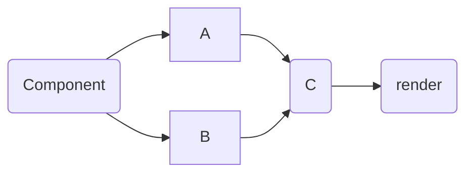
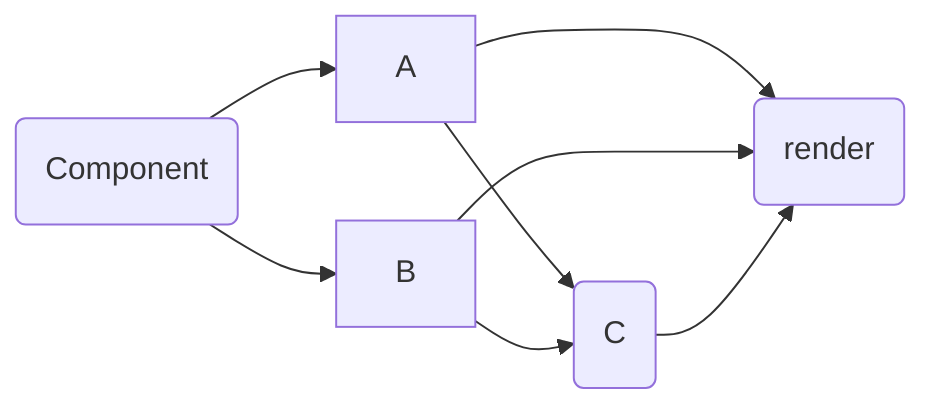

# Orve
Эта библиотека поможет вам создавать реактивные интерфейсы.

# Подход в реактивности и посмотрение компонентов.
Если вы уже работали с другими инструментами, вы привыкли что есть какая-то логика внутри компонента и то, что он возвращает - элементы компонента.

Так происходит построение дерева и потом при изменение реактивной переменной, функция рендера пересобирается и изменяется какие-то части приложения.

В orve немного другой подход. Каждый ваш компонент, будет собираться только один раз. 

К примеру:
```javascript
function App() {
	<...Код...>

	return (
		<>
			<div id="1">....</div>
			<Инструмент с условным рендерингом>
				<div id='2' if="...">...</div>
				<div id='2' else>...</div>
			</Инструмент с условным рендерингом>
			<Цикл>
				() => <div id='3'>...</div>
			</Цикл>
			<Динамический компонент id="4" />
		</>
	)
}
```
Выше представлен код компонента. Так как на этот момент мы многое не знаем про библиотеку. Я написал часть инструментов в псевдо-коде. По ходу доки вы поймёте, что мы пишем вместо данных конструкций.

Окей.  Теперь попытаемся понять логику рендера. Когда вы отдаёте этот компонент сначала в парсер, а потом уже в рендер мы получаем следующий результат.

 Секция `<...Код...>` будет выполнена только один раз. Конечно если этот код лежит в динамическом компоненте или же в каком-то условии, то да, он может перезапускаться.

После блока кода. 
Элемент с `id = '1'` будет статикой и если в компоненте будет реактивно меняться какая-то переменная, этот блок вообще никак не будет пересчитываться.

Все остальные `id` имеют какие-то условия, где могут вызываться не один раз.
>Хотя там тоже есть некоторые условия, о них позже.

Окей, надеюсь идея понятна.

Попробуйте при разработке, мысленно понимать, какие куски могут быть вызваны повторно, а какие не будут. Это поможет вам проще создавать компоненты и переиспользовать их.

## Реактивность
Давайте представим пример.

У нас есть примитив `A` и `B`, задача вывести результат `C` на экран и сделать так, чтобы при изменение `A` или `B`  менялся и `C`

Получается итоговая схема будет выглядить так



Смотря на схему, можно выстроить себе цепочку
`Component -> (A & B) -> C -> render`
Отлично, Если помимо `C` нужно вывести условно пример вида
`A + B = C`

Тогда схема будет такой. Немного запутано.

Окей, опустим схему сверху, вернитесь к ней, как будете готовы.

Вернёмся к 1 схеме.

Для того, чтобы создать один элемент реактивности, можно использовать `ref`
Вы почитаете о нём ниже, пока базово.

Для связи нескольких реактивных переменных. Есть 2 пути решения. `Computed` и `ComputedEffect`

Они оба принимают функцию, которая что-то возвращает. Отличия в том, что в `computed` мы должны сами указывать массив реактивных переменных. В свою очередь `computedEffect` сам поймёт какие реактивные переменные используются внутри. Если вы хотите полностью сами руководить пересчётами в `computed` то используйте `computed`.  Если вам важен только результат, используйте  `computedEffect`

Окей, об этом будет чуть ниже, сейчас перейдём к коду, который получиться в итоге.

```javascript
function App() {
	const A = ref(...)
	const B = ref(...)
	const C = computed(() => A.value + B.value, [A, B])
	// Или
	const C = computedEffect(() => A.value + B.value)

	return (
		<div>{C}</div>
	)
}
```

Попробуйте на основе этого примера, сделать реализацию 2 схемы.

Обдумывание цепочек реактивности. И идея о том, что то, что вы пишите, будет выполняться один раз и будет играть главную роль при разработке на Orve.


# Компоненты
Компонент, это функция. 
Вы можете использовать стрелочную функцию, но лучше использовать обычную.

>При использование стрелочной функции теряется контекст, что будет мешать работе с контекстом. Но если вы уверены, что вам не нужен контекст в компоненте. То вы можете спокойно использовать стрелочную функцию.

*Пожалуйста не забывайте называть компоненты, это облегчит вам дебаг приложения*
Пример компонента:
```javascript
export default function App(props) {
	return (
		...jsx
	)
}
```

## context
Для удобной работы с контекстом, обращайтесь к `this` в функции.

`this` - хранит объект `context`

>Стоит заметить, что вы спокойно можете мутировать контекст, если вам это будет необходимо.
>
>Все компоненты, который находяться ниже мутированного контекста получат мутированный контекст. Таким образом можно прокидывать различную информацию.

## props
Вы можете прокидывать данные в компонент. Все что вы поместите в компонент, будет направлено в функцию компонента. 

```javascript
<Component id="1" name={"asd"} test={variable} ....></Component>
|
function Component({ id, name, test }) {}
```
Если компонент такого вида:
```javascript
<Component>
....
</Component>
```
То в props добавиться массив `children`
Чтобы использовать его, можно просто указать
```javascript
function Component({ children }) {
	return (
		<div>
			{children} --> 'array" - В таком случаи парсер сам развернёт массив.
		</div>
	)
}
```
В отличие от React, у вас есть возможность спокойно писать class внутри компонентов.
Если парсер понимает, что класс прокидывается как пропс, он добавит к нему символ 
`o` - в таком случаи:

```javascript
<Component `class="123"` /> === function Component({ oclass: "123" }) {}
```

Вам нет необходимости убирать `o` чтобы использовать `oclass` в качестве класса компонента.

Парсер сам уберёт o

Пример:
```javascript
function Component({children, ...props}) {
	return (
		<div {...props}>{children}</div>
	)
}

// Этот компонент главный
export default function App() {
	return (
		<div>
			<Component class="123" />
		</div>
	)
}

```
Получим в итоге
```javascript
<div id="app">
	<div>
		<div class="123">
		</div>
	</div>
</div>
```

### Цикл компонентов.
Иногда есть необходимость переиспользовать компонент несколько раз внутри этого же компонента.
```javascript
function Comment({ i }) {
	if (i === 100) return (<div>End</div>)
	return (
		<div>
			<div>Author: "{i}"</div>
			<Comment name={i + 1} />
		</div>
	)
}
```
Хоть парсер и написан так, чтобы не создать рекурсию в таких случаях, но всё равно может быть ситуации, когда в консоле будет выпадать ворнинг
`RangeError: Maximum call stack size exceeded`

В таком случаи приложение отработает до сломанного компонента и не будет дальше собираться.

На данный момент парсер и маунтер работают до 1280 вложенных компонентов.

### Slot

Иногда при разработке компонентов, есть потребность использовать `Slot`

```javascript
function Modal() {
	return (
		<div class="wrapper">
			<div class="modal>
				<div>
					// HEADER
				</div>
				<div>
					// Body
				</div>
				<div>
					// Footer
				</div>
			</div>
		</div>
	)
}
```
В таком случаи трудно распределить куски кода по секциям.

У вас есть несколько способов решения данной проблемы. Например прокидывать пропсами куски jsx и вставлять их.
Такой способ будет работать, но он начинает мешать jsx вместе с кодом.

Если вы привыкли так решать данную задачу, вы также сможете решить её тут.

В противном случаи у вас есть возможность использовать Fragment.

Для этого в компоненте необходимо указать вот такие конструкции.

```javascript
function App() {
	return (
		<Modal>
			<Fragment name="header">...</Fragment>
			<Fragment name="body">...</Fragment>
			<Fragment name="footer">...</Fragment>
		</Modal>
	)
}

```

В случаи если name не указать, код внутри `Fragment` будет считаться `default` внутри компонента

*Обратите внимание, slot можно использовать только в компонентах*

Данные `slot` буду объявлены в `props` 
>Он указан всегда в prop, но вы можете спокойно спретить пропсы внутри компонента, на моменте парсинга, слот будет убран

```javascript
function Modal({ $slot }) {
	return (
		<div class="wrapper">
			<div class="modal>
				<div>
					{$slot.header}
				</div>
				<div>
					{$slot.body}
				</div>
				<div>
					{$slot.footer}
				</div>
			</div>
		</div>
	)
}
```
В таком случаи `slot` будут работать

Если есть необходимость задать значение по умолчанию:

Тогда вы можете использовать "??":

```
{ $slot.header ?? <...jsx> }
```

*Слоты на данный момент не реактивны, поэтому будте аккуратны*
  

### Типизация пропсов.
Внутри компонента есть возможно объявить валидацию props.
Чтобы это сделать необходимо указать у компонента свойство `props`

```javascript
function App() {
	return (
		<div>
			...
		</div>
	)
}

App.props = {
	...
}
```

объект `props` представляет собой входящие `props` комопнента.
Нет необходимости описывать все пропсы.
Используйте только для тех, которых вам действительно важны.
Объект состоит из ключа `props` и инструкции
Например, вы хотите сделать так, чтобы атрибут `key` для компнента выше принимал только `String`.
Для этого в `props` укажите

```javascript
App.props = {
	key: {
		type: String
	}
}
```

В данном случаи, если в key будет отправлено значение, которое не удовлетворяет типу, в итоговый `props` с `key` ничего не попадёт.

В данном случаи легче ничего не отправлять чем указывать какое-то значение по умолчанию.

Если вы хотите сообщать пользователю, что данный prop необходим, укажите свойство
```javascript
App.props = {
	key: {
		type: String,
		required: true
	}
}
```
В таком случаи, компонент будет отрисовываться, но в консоле будет ошибка. Вместо значения, ничего не будет отображаться.

Если вы хотите указать значение по умолчанию, тогда вам достаточно указать свойство `default`

Данное свойство будет вставлять значени по умолчанию, если какое-то условие не было выполнено.

```javascript
App.props = {
	key: {
			type: String,
			required: true,
			default: "test"
		}
	}
}
```

Данное свойствой принимает значениe или функцию.

Например для того, чтобы задать [] или {} лучше это делать так

```javascript
default: () => []
default: () => ({})
```

Чтобы перестраховываться, пожалуйста прописывайте все необходимые свойства, а именно `type, default, required`.

Если есть необходимость прописать несколько типов, допустим, в key теперь надо отправлять или String или Number.

Для этого, достачно указать тип в массиве.
```javascript
App.props = {
	key: {
		type: [String, Number],
		required: true,
		default: "test"
	}
}
```
В таком случаи проверка будет проходить по 2 типам.

>Стоит заметить, что функционал проверки props не вшит куда-то внутрь парсера или рендера. Это обертка вокруг функции вашего компонента.

Альтернативный синтаксис для props.

```javascript
function App() {
	return (
		...
	)
}

export default definedProps(App, { ... })
```
`definedProps` принимает в себя функцию компонента и вторых аргументов сами настройки.

### HTML in jsx

Вы можете использовать HTML внутри компонентов.

```javascript
function App() {
	return (
		<div>
			{ `<div>....</div>` }
		</div>
	)
}

```

Обратите внимание, чтобы у кода всегда был родительский элемент, это необходимо, чтобы парсер правильно обработал код.

Вы так же можете присваивать данные строки в реактивные переменные и их реактивно изменять. 

### o-hooks, o-key, o-ref

Помимо обычных атрибутов, есть специальные, которые нужно заполнять по правилам.

#### o-hooks

Это объект представляющий собой совокупность функций жизненого цикла компонента.

На данный момент есть такие функции

```javascript
{
	beforeCreate(),
	created(),
	beforeMount(),
	mounted(),
	beforeUnmount(),
	unmounted(),
}
```

Данные функции ничего не принимают, могут быть асинхронными.

Когда компонент подойдёт к определенной стадии жизненного цикла, будет вызвана необходимая функция.

```javascript
function App() {
	return (
		<div o-hooks={{  created() { ... } }}></div>
	)
}

function App() {
	return (
		<div></div>
	)
}

App.hooks = {}
```

Вы можете навесить hooks на любой элемент внутри компонента.

#### o-key
Данный prop нужен скорее для `<o-for>`, хотя на самом деле, он не обязателен. Просто знайте, что есть такая возможность )

#### o-ref
Это специальная свойство, которое хранит в себе реактивную ссылку на элемент `refL()`

  
  

### Event
Для того, чтобы привязать слушатель события необходимо написать в аттрибутах

on<Название события> --- onInput, onClick, onChange.

*Вы можете писать как onInput, так и oninput*

слушатель события отработает как нужно.

```javascript
function App() {
	return (
		<div onClick={(event) => {....}} ></div>
	)
}
```


# ref

Единицей реактивной переменной в компоненте, является ref. Она помогает хранить значение, понимать когда оно поменяется и работать самой с элементами в компоненте.  То есть после того, как вы укажите реактивную переменную, или как ребенка или как атрибут какого-то элемента, сама реактивная переменная будет следить за тем куда и что отображать. 

На данный момент вы можете хранить в `ref` :

* Undefined
* Null
* Number
* String
* Boolean
* Object
* Array
